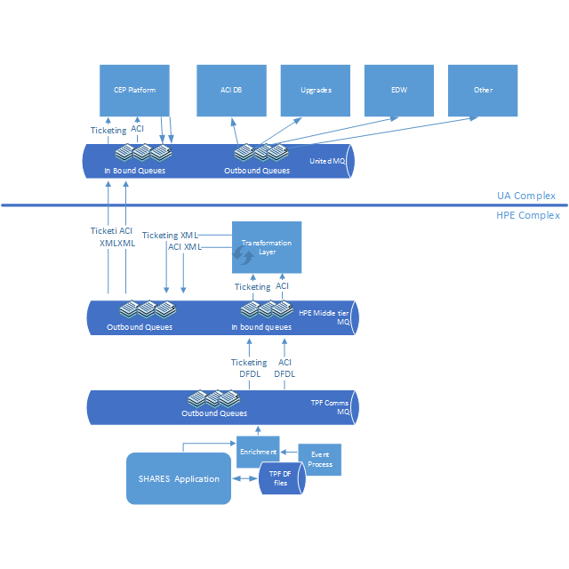
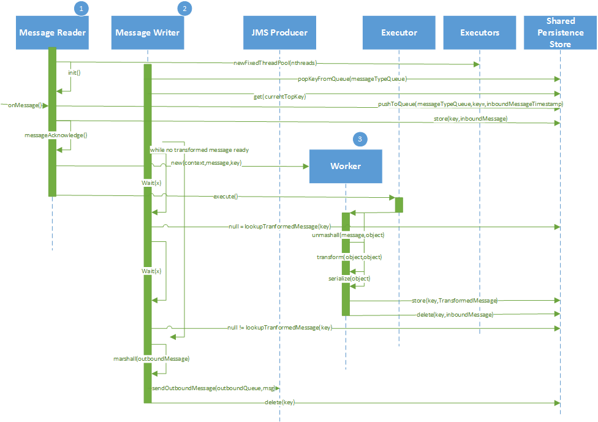
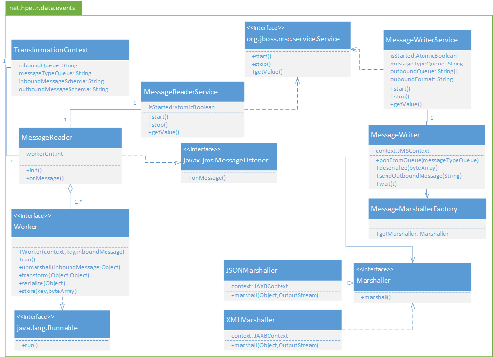

title: Data Events Middle-Tier Architecture & Design Document
-------------------------------------------------------------

# Data Events Middle-Tier Architecture & Design Document #

## About this Document ##
The HTML version of this document may be generated using a couple of approaches:

1. This approach allows for previewing the updates to the document during editing phase. This uses
	[Markdown Live](https://www.npmjs.com/package/markdown-live). After following the installation
	instructions on the website, Run

		mdlive --file design.md

	from the command-line to generate an HTML view of the document *live* while editing it.

2. Using [Markdown Styles](http://mixu.net/markdown-styles/).
   After following installation instruction on the website, run the following command to generate
   the HTML version of the document:

        cd tr-data-events-mt\src\main
        generate-md --layout mixu-page --input . --output ..\..\target\markdown\
        ..\..\target\markdown\design.html

The markdown format was chosen so as to keep the design document:
1. current and be able change at the pace of other components within the source tree
2. version consistent with the version of the source code in the version control repository
3. easily updatable with source code snippets without having to worry about formatting issues that
   arise in Microsoft Word and HTML.

and also to

4. leverage GitHub enterprise Markdown documentation features.
5. leverage large array of tools available in the open source community.
6. be able to generate multiple output formats such as PDF from one source document

## Introduction ##

This effort is a subset of the Data and Signal events or Data Feed or Data Events roadmap project
which is a component of HPE PSS Modernization. The goal of this projects is to modernize how data
and business events are exchanged between the host airline reservation system and the remaining
components of the PSS ecosystem aligned to the [HPE / UA Reference Architecture][1]. A summary of
the Reference Architecture is available [here][2].

It is strongly recommended that readers of this document familiarize themselves with the [Reference
Architecture] to fully understand and appreciate the design trade-offs in favor of the larger
architectural goals.

The vision of this effort is expected to be realized in 4 phases. The first phase is to deploy the
software and hardware components necessary to enable the end to end modernization in alignment with
the United and HPE reference architecture. This phase of the project intends to provide a canonical
set of interfaces exposed to the airline for consumption in relation to departure control and ticketing.
This promotes loose coupling between the airline event consumers and the host application SHARES.
In addition, this approach encapsulates the host specifics behind the mid-tier and allows airline
systems to consume information using standardized formats.

The project phases are expected to include the following:

1.	Abstraction layer: Deployment of messaging and transformation components with activation of select messages
2.	Event Logging and Resend: Deployment of logging and ability to resend information back to a select check point. This release will also accommodate additional message types
3.	Data Capture: Full data capture to enable send of delta or full messages based on subscriber
4.	Data Access: Redirect of data access services to off host platform

## Purpose of this document ##
The purpose of this document is outline the design which will be used to implement the *mid-tier*
portion of the effort.

## Audience ##
The intended audience of this document are:

1. HPE and Airline Architects
2. HPE Engineers

## High Level Design ##
Current SHARES Data Feeds have evolved over the last 30 years or so. These feeds are generated by
executing hooks within the SHARES' application at appropriate points in time during transaction
processing. Due to the nature of the evolution of these feeds and because an update to the feed may
not be triggered every time in a consistent manner, current feeds data quality may not be 100%
accurate all the time. These feeds are currently distributed in a variety of wire formats such as
XDR (e.g. PNR) over MQ and EBCDIC binary records over sockets (Inventory).

The goal of this project is to standardized data distribution (replication) over a standardized
Event format and over a standardized protocol such as MQ.

The interface between SHARES and the Middle-Tier is considered a private interface. HPE has
flexibility to determine Event representation and the transmission protocol (such as MQ). These
choices should of course satisfy the Service Level Agreements currently in place for SHARES.

The interface between HPE Middle-Tier and the airline consuming the Event stream is considered
public. This interface should be designed for the widest possible consumption. HPE and United
airlines currently co-fund this effort.

### Message Flow ###
Using modern products on SHARES, Events can be generated anytime files of interest are updated.
These Events are then published onto the SHARES MQ Queue Manager. Since there are restrictions on
directly connecting and consuming messages from SHARES MQ Queue Manager, a Middle-Tier WebSphere
Queue Manager will be established. Messages are then sent from SHARES MQ Queue Manager to the
Middle-Tier Queue Manager. JMS Consumers will then dequeue these messages from the Middle-Tier Queue
Manager for processing.

On the Middle-Tier, messages are parsed and transformed into a Java based representation. This Java
representation is then used to generate target representation that will be sent to the airline. Once
this target representation is generated, it is published back on to the Middle-Tier Queue Manager
queues destined to the airline's queue manager.

Airline's application will consume the transformed message by connecting the Airline's Queue Manager
and store/process these messages further.

The following diagram depicts this process:

### Multi-channel MQ on SHARES

Current Websphere MQ installation on SHARES has limitations due to the real-time nature of the system.
Specifically, there are limits on the maximum number of messages per sec on a given queue on SHARES.
To work around this limitation, some feeds are currently throttled.

However, a new feature called "multi-channel" MQ enables aggregating multiple queues to send
messages or Events.

### Event Sequencing
Since all Events are going to be incremental, meaning only changes or deltas in the record will be
published to the Event stream, ordering of Events must be preserved to replicate the exact state of
the host system (SHARES).

This Event ordering presents a scalability and performance challenge in a distributed environment.
In order to sequence Events properly, knowledge of prior Events or some temporal attributes need to
be introduced so that sequencing can be performed. A few strategies can be employed and each of these
strategies or options have their own strengths and challenges. These are discussed in the following
sections.

### Sharding at the source

Events can be sharded based on a pre-defined key on SHARES. This allows messages pertaining to
a particular record to always end up on the same queue. This eliminates the resequencing burden on
the receiver because all updates specific to an record always appear on the same queue and those
updates will of course be in order since they will always be published to the same queue.

A new framework will be developed to perform this sharding and also to leverage the "multi-channel"
MQ feature. Together, the "multi-channel" MQ feature and the sharding capability allows us to
publish Events at a high volume in-order.

However, the number of channels which may be created on SHARES are finite and very small in number
still. It is expected that no more than a total of 10-15 queues may be created using the
multi-channel feature according to the SHARES COMMS team. This does imply that there an upper bound
to the maximum number of Events which may be published into the system as a whole.

The benefit of this approach is that, if the listeners on the Middle-Tier can keep up with the Event
publishing rate using a single thread/instance, no re-sequencing needs to be performed. This will
however mean that there would only be one component listening for messages and should that
component/instance fail, processing could halt unless manual intervention happens. In order to
prevent that, a cluster using master/slave approach could be used. The master will normally process
messages while that slaves would be on stand-by. Should the master fail for some reason, the
clustering software (such as JBoss Clustering or JBoss Singleton) would promote the slave to be the
new master. This would eliminate the single-point-of-failure in the design at the expense of a more
complex clustering scheme.

### Resequence messages on the receiving side

Events may be published in order from the source. But for throughput and performance reasons,
multiple listeners may be attached to a single queue. These listeners may exist for different
machines. This distributed setup will require coordination across multiple machines and processes.
This would not only result in significant additional complexity, but also requires thorough testing
of the failover scenarios.

The resequencing itself maybe performed by

1. further sharding messages into additional queues. This would require a listener with the sole
   purpose of deciding how messages would have to be sharded and then publish those messages on to
   additional queues.
2. using a data store or cache to facilitate resequencing. E.g. REDIS may be used to implement
   Queue-like behaviour using RPUSH and LPOP commands.

### Event Volumes ###
The initial platform capacity is based on certain volume assumptions enumerated below. These volumes
are educated estimates based on past experience and assumptions.

Event                            | Average TPS    | Peak TPS  | Current Daily total
---------------------------------|----------------|-----------|----------------------
TDR Passenger Seatmap and Flight | 500            | 1,000*    | 7.5
Ticketing                        | 250            | 1,600     | 4.6
PNR (next release)               | 160            | 400       | 4.8
Inventory (next release)         | 250            | 300       | 4.0
<strong>Total</strong>           | 1,160          | 3,300     | 20.9

Notes:

1. ACI feeds are currently throttled at 1000 TPS max, this will change with MQ Multi channel and this volume is expected to increase
2. The new Data Events are triggered based on file data updates, which means the volume and frequency of events will increase across all channels, the amount of increase is not known at this time
3. Platform headroom for capacity will be determined once software optimization and performance testing is conducted.

## Event Types ##
Following Event streams are expected out of this effort from SHARES.

Category   | Event Name    | SHARES Representation   | SHARES Event Type  | Update Type
---------|---------------|-----------------------|--------------------------------------------
Flight   | Detail        | Flat Files            | Signal Event       | Delta
Flight   | Control set   | DF Record             | Data Event         | Delta
Flight   | Remark        | DF Record             | Data Event         | Delta
Flight   | Seatmap       | Flat Files            | Signal Event       | Delta
PNR      | PNR           | Flat Files            | Signal Event       | Delta
Inventory| Inventory     | Flat Files            | Signal Event       | Delta
TDR*     | TDR           | DF Record             | Data Event         | Delta
Ticket   | Ticket        | DF Record             | Data Event         | Delta

\*TDR - Traveler Data Record

Some current Data Feeds provide full record updates in the feed on every data update. However, the
modern Events will only include the updated fields - Deltas from the previous state to the current
state.

## Event Representation ##
This section discusses how the message will be represented both from a syntactic (XML/binary/JSON) and semantic (Common Base Event/HPE Middle-Tier format etc) standpoint.

### Performance Considerations ###
Message representation is expected to have a significant impact in performance i.e. the
number of messages which can be processed on a per core basis and the amount of throughput of the
aggregate system.

Various trade-offs will be explored in this document to satisfy the requirements outlined in the
[Systemic Qualities](#Systemic Qualities) section of this document.

### SHARES Event Structure ###
The message sent from SHARES may be generated via either a Data Event or a Signal Event. At the time
of this writing (Feb 2017), it is unknown whether these two events have structuarlly similar format.

However, the Data Event representation is known at this time and is listed below.

#### Data Events ####

The following snippets of messages represents a sample Data Event in various formats

##### JSON format

<pre>
      {
        "Event": {
          "EventHeader": {
            "size": "61",
            "structID": "C5C8",
            "version": "01",
            "ECBCtxFlag": "0",
            "UsrCtxFlag": "1",
            "spareBits": "0",
            "eventName": "Credit_Trxns",
            "eventType": "02",
            "spare1": "0000",
            "ssuName": "HPN ",
            "eventTime": "2015-09-23T19:54:16.754",
            "fractionalMicSec": "289",
            "spare2": "000000000000000000000000",
            "interceptName": "QZZ1"
          },
          "EventUserContext": {
            "version": "1",
            "version_choice": {
              "ver_1": {
                "ecbSVA": "274776064",
                "ecbCreateTime": "14958702004928336160",
                "ecbEventCount": "5",
                "inputMsgLength": "11",
                "inputMsg": "ztest qzz1"
              }
            }
          },
          "EventData": {
            "EventDataHdr": {
              "size": "392",
              "structID": "C5C4",
              "version": "1",
              "dataType": "1",
              "changeType": "02",
              "spare1": "0000",
              "errFlag": "00",
              "offsetToData": "120",
              "spare2": "0000000000000000",
              "dfsubfile": {
                "sw02srPtr": "0000000000000000",
                "filename": "DR12ED",
                "fileID": "B212",
                "accessFlags": "00",
                "controlFlags": "00",
                "spare1": "00000000",
                "ssName": "BSS ",
                "ssUserName": "HPN ",
                "primeFA": "402791194",
                "lrecCount": "4",
                "spare2": "0000",
                "sequence": "10",
                "timestamp": "00CF97FC381CC6950000000001230000",
                "ordinal": "0",
                "spare3": "0000000000000000000000000000",
                "partition": "0",
                "interleave": "0",
                "algorithmType": "0",
                "algorithmPath": "0",
                "algorithmLength": "0"
              }
            },
            "DEVLRECS": {
              "devLrecHdr": {
                "size": "68",
                "version": "01",
                "errInd": "00",
                "changeType": "02",
                "lrecID": "D7",
                "sequence": "10"
              },
              "prefixedLrec": {
                "LRECPrefix": {
                  "size": "58",
                  "spare": "0000"
                },
                "DFLREC": {
                  "lrecLength": "52",
                  "lrecKey": "D7",
                  "lrecD7": {
                    "DR12ND7": "MISS PIGGY",
                    "DR12VID": "F9F8F7F6F5",
                    "DR12DAT": "2013 NOV2",
                    "DR12TIM": "13:04",
                    "spare": "0000",
                    "DR12AMT": "1.000000e+02",
                    "DR12KD7": "40"
                  }
                }
              }
            }
          }
        }
      }
</pre>

##### XML format

      <?xml version="1.0" encoding="utf-8" ?>
      <Credit_Trxns:Event xmlns:Credit_Trxns="http://www.ibm.com/xmlns/prod/ztpf/dfdl/de/Credit_Trxns">
        <Credit_Trxns:EventHeader>
          <ibev:size xmlns:ibev="http://www.ibm.com/xmlns/prod/ztpf/dfdl/lib/ibev">61</ibev:size>
          <ibev:structID xmlns:ibev="http://www.ibm.com/xmlns/prod/ztpf/dfdl/lib/ibev">C5C8</ibev:structID>
          <ibev:version xmlns:ibev="http://www.ibm.com/xmlns/prod/ztpf/dfdl/lib/ibev">01</ibev:version>
          <ibev:ECBCtxFlag xmlns:ibev="http://www.ibm.com/xmlns/prod/ztpf/dfdl/lib/ibev">0</ibev:ECBCtxFlag>
          <ibev:UsrCtxFlag xmlns:ibev="http://www.ibm.com/xmlns/prod/ztpf/dfdl/lib/ibev">1</ibev:UsrCtxFlag>
          <ibev:spareBits xmlns:ibev="http://www.ibm.com/xmlns/prod/ztpf/dfdl/lib/ibev">0</ibev:spareBits>
          <ibev:spareBits xmlns:ibev="http://www.ibm.com/xmlns/prod/ztpf/dfdl/lib/ibev">0</ibev:spareBits>
          <ibev:spareBits xmlns:ibev="http://www.ibm.com/xmlns/prod/ztpf/dfdl/lib/ibev">0</ibev:spareBits>
          <ibev:spareBits xmlns:ibev="http://www.ibm.com/xmlns/prod/ztpf/dfdl/lib/ibev">0</ibev:spareBits>
          <ibev:spareBits xmlns:ibev="http://www.ibm.com/xmlns/prod/ztpf/dfdl/lib/ibev">0</ibev:spareBits>
          <ibev:spareBits xmlns:ibev="http://www.ibm.com/xmlns/prod/ztpf/dfdl/lib/ibev">0</ibev:spareBits>
          <ibev:eventName xmlns:ibev="http://www.ibm.com/xmlns/prod/ztpf/dfdl/lib/ibev">Credit_Trxns</ibev:eventName>
          <ibev:eventType xmlns:ibev="http://www.ibm.com/xmlns/prod/ztpf/dfdl/lib/ibev">02</ibev:eventType>
          <ibev:spare1 xmlns:ibev="http://www.ibm.com/xmlns/prod/ztpf/dfdl/lib/ibev">0000</ibev:spare1>
          <ibev:ssuName xmlns:ibev="http://www.ibm.com/xmlns/prod/ztpf/dfdl/lib/ibev">HPN </ibev:ssuName>
          <ibev:eventTime xmlns:ibev="http://www.ibm.com/xmlns/prod/ztpf/dfdl/lib/ibev">2015-09-23T19:54:16.754</ibev:eventTime>
          <ibev:fractionalMicSec xmlns:ibev="http://www.ibm.com/xmlns/prod/ztpf/dfdl/lib/ibev">289</ibev:fractionalMicSec>
          <ibev:spare2 xmlns:ibev="http://www.ibm.com/xmlns/prod/ztpf/dfdl/lib/ibev">000000000000000000000000</ibev:spare2>
          <ibev:interceptName xmlns:ibev="http://www.ibm.com/xmlns/prod/ztpf/dfdl/lib/ibev">QZZ1</ibev:interceptName>
        </Credit_Trxns:EventHeader>
        <Credit_Trxns:EventUserContext>
          <Credit_Trxns_Usrctx:version xmlns:Credit_Trxns_Usrctx="http://www.ibm.com/xmlns/prod/ztpf/dfdl/user/Credit_Trxns_Usrctx">1</Credit_Trxns_Usrctx:version>
          <Credit_Trxns_Usrctx:version_choice xmlns:Credit_Trxns_Usrctx="http://www.ibm.com/xmlns/prod/ztpf/dfdl/user/Credit_Trxns_Usrctx">
            <Credit_Trxns_Usrctx:ver_1>
              <Credit_Trxns_Usrctx:ecbSVA>274776064</Credit_Trxns_Usrctx:ecbSVA>
              <Credit_Trxns_Usrctx:ecbCreateTime>14958702004928336160</Credit_Trxns_Usrctx:ecbCreateTime>
              <Credit_Trxns_Usrctx:ecbEventCount>5</Credit_Trxns_Usrctx:ecbEventCount>
              <Credit_Trxns_Usrctx:inputMsgLength>11</Credit_Trxns_Usrctx:inputMsgLength>
              <Credit_Trxns_Usrctx:inputMsg>ztest qzz1</Credit_Trxns_Usrctx:inputMsg>
            </Credit_Trxns_Usrctx:ver_1>
          </Credit_Trxns_Usrctx:version_choice>
        </Credit_Trxns:EventUserContext>
        <Credit_Trxns:EventData>
          <Credit_Trxns:EventDataHdr>
            <cdev:size xmlns:cdev="http://www.ibm.com/xmlns/prod/ztpf/dfdl/lib/cdev">392</cdev:size>
            <cdev:structID xmlns:cdev="http://www.ibm.com/xmlns/prod/ztpf/dfdl/lib/cdev">C5C4</cdev:structID>
            <cdev:version xmlns:cdev="http://www.ibm.com/xmlns/prod/ztpf/dfdl/lib/cdev">1</cdev:version>
            <cdev:dataType xmlns:cdev="http://www.ibm.com/xmlns/prod/ztpf/dfdl/lib/cdev">1</cdev:dataType>
            <cdev:changeType xmlns:cdev="http://www.ibm.com/xmlns/prod/ztpf/dfdl/lib/cdev">02</cdev:changeType>
            <cdev:spare1 xmlns:cdev="http://www.ibm.com/xmlns/prod/ztpf/dfdl/lib/cdev">0000</cdev:spare1>
            <cdev:errFlag xmlns:cdev="http://www.ibm.com/xmlns/prod/ztpf/dfdl/lib/cdev">00</cdev:errFlag>
            <cdev:offsetToData xmlns:cdev="http://www.ibm.com/xmlns/prod/ztpf/dfdl/lib/cdev">120</cdev:offsetToData>
            <cdev:spare2 xmlns:cdev="http://www.ibm.com/xmlns/prod/ztpf/dfdl/lib/cdev">0000000000000000</cdev:spare2>
            <cdev:dfsubfile xmlns:cdev="http://www.ibm.com/xmlns/prod/ztpf/dfdl/lib/cdev">
              <cdev:sw02srPtr>0000000000000000</cdev:sw02srPtr>
              <cdev:filename>DR12ED</cdev:filename>
              <cdev:fileID>B212</cdev:fileID>
              <cdev:accessFlags>00</cdev:accessFlags>
              <cdev:controlFlags>00</cdev:controlFlags>
              <cdev:spare1>00000000</cdev:spare1>
              <cdev:ssName>BSS </cdev:ssName>
              <cdev:ssUserName>HPN </cdev:ssUserName>
              <cdev:primeFA>402791194</cdev:primeFA>
              <cdev:lrecCount>4</cdev:lrecCount>
              <cdev:spare2>0000</cdev:spare2>
              <cdev:sequence>10</cdev:sequence>
              <cdev:timestamp>00CF97FC381CC6950000000001230000</cdev:timestamp>
              <cdev:ordinal>0</cdev:ordinal>
              <cdev:spare3>0000000000000000000000000000</cdev:spare3>
              <cdev:partition>0</cdev:partition>
              <cdev:interleave>0</cdev:interleave>
              <cdev:algorithmType>0</cdev:algorithmType>
              <cdev:algorithmPath>0</cdev:algorithmPath>
              <cdev:algorithmLength>0</cdev:algorithmLength>
            </cdev:dfsubfile>
          </Credit_Trxns:EventDataHdr>
          <Credit_Trxns:DEVLRECS>
            <Credit_Trxns:devLrecHdr>
              <cdev:size xmlns:cdev="http://www.ibm.com/xmlns/prod/ztpf/dfdl/lib/cdev">68</cdev:size>
              <cdev:version xmlns:cdev="http://www.ibm.com/xmlns/prod/ztpf/dfdl/lib/cdev">01</cdev:version>
              <cdev:errInd xmlns:cdev="http://www.ibm.com/xmlns/prod/ztpf/dfdl/lib/cdev">00</cdev:errInd>
              <cdev:changeType xmlns:cdev="http://www.ibm.com/xmlns/prod/ztpf/dfdl/lib/cdev">02</cdev:changeType>
              <cdev:lrecID xmlns:cdev="http://www.ibm.com/xmlns/prod/ztpf/dfdl/lib/cdev">D7</cdev:lrecID>
              <cdev:sequence xmlns:cdev="http://www.ibm.com/xmlns/prod/ztpf/dfdl/lib/cdev">10</cdev:sequence>
            </Credit_Trxns:devLrecHdr>
            <Credit_Trxns:prefixedLrec>
              <ns0:LRECPrefix xmlns:ns0="http://www.ibm.com/xmlns/prod/ztpf/dfdl/tpfdf/DR12ED">
                <ns0:size>58</ns0:size>
                <ns0:spare>0000</ns0:spare>
              </ns0:LRECPrefix>
              <ns0:DFLREC xmlns:ns0="http://www.ibm.com/xmlns/prod/ztpf/dfdl/tpfdf/DR12ED">
                <ns0:lrecLength>52</ns0:lrecLength>
                <ns0:lrecKey>D7</ns0:lrecKey>
                <ns0:lrecD7>
                  <ns0:DR12ND7>ROSIEARMSTRONG      </ns0:DR12ND7>
                  <ns0:DR12VID>012345678F</ns0:DR12VID>
                  <ns0:DR12DAT>2007JUL31</ns0:DR12DAT>
                  <ns0:DR12TIM>12:05</ns0:DR12TIM>
                  <ns0:spare>0000</ns0:spare>
                  <ns0:DR12AMT>1.000000e+02</ns0:DR12AMT>
                  <ns0:DR12KD7>10</ns0:DR12KD7>
                </ns0:lrecD7>
              </ns0:DFLREC>
            </Credit_Trxns:prefixedLrec>
          </Credit_Trxns:DEVLRECS>
          <Credit_Trxns:DEVLRECS>
            <Credit_Trxns:devLrecHdr>
              <cdev:size xmlns:cdev="http://www.ibm.com/xmlns/prod/ztpf/dfdl/lib/cdev">68</cdev:size>
              <cdev:version xmlns:cdev="http://www.ibm.com/xmlns/prod/ztpf/dfdl/lib/cdev">01</cdev:version>
              <cdev:errInd xmlns:cdev="http://www.ibm.com/xmlns/prod/ztpf/dfdl/lib/cdev">00</cdev:errInd>
              <cdev:changeType xmlns:cdev="http://www.ibm.com/xmlns/prod/ztpf/dfdl/lib/cdev">02</cdev:changeType>
              <cdev:lrecID xmlns:cdev="http://www.ibm.com/xmlns/prod/ztpf/dfdl/lib/cdev">D7</cdev:lrecID>
              <cdev:sequence xmlns:cdev="http://www.ibm.com/xmlns/prod/ztpf/dfdl/lib/cdev">10</cdev:sequence>
            </Credit_Trxns:devLrecHdr>
            <Credit_Trxns:prefixedLrec>
              <ns0:LRECPrefix xmlns:ns0="http://www.ibm.com/xmlns/prod/ztpf/dfdl/tpfdf/DR12ED">
                <ns0:size>58</ns0:size>
                <ns0:spare>0000</ns0:spare>
              </ns0:LRECPrefix>
              <ns0:DFLREC xmlns:ns0="http://www.ibm.com/xmlns/prod/ztpf/dfdl/tpfdf/DR12ED">
                <ns0:lrecLength>52</ns0:lrecLength>
                <ns0:lrecKey>D7</ns0:lrecKey>
                <ns0:lrecD7>
                  <ns0:DR12ND7>ROSIEARMSTRONG      </ns0:DR12ND7>
                  <ns0:DR12VID>005566777F</ns0:DR12VID>
                  <ns0:DR12DAT>2007FEB12</ns0:DR12DAT>
                  <ns0:DR12TIM>20:20</ns0:DR12TIM>
                  <ns0:spare>0000</ns0:spare>
                  <ns0:DR12AMT>1.000000e+02</ns0:DR12AMT>
                  <ns0:DR12KD7>20</ns0:DR12KD7>
                </ns0:lrecD7>
              </ns0:DFLREC>
            </Credit_Trxns:prefixedLrec>
          </Credit_Trxns:DEVLRECS>
          <Credit_Trxns:DEVLRECS>
            <Credit_Trxns:devLrecHdr>
              <cdev:size xmlns:cdev="http://www.ibm.com/xmlns/prod/ztpf/dfdl/lib/cdev">68</cdev:size>
              <cdev:version xmlns:cdev="http://www.ibm.com/xmlns/prod/ztpf/dfdl/lib/cdev">01</cdev:version>
              <cdev:errInd xmlns:cdev="http://www.ibm.com/xmlns/prod/ztpf/dfdl/lib/cdev">00</cdev:errInd>
              <cdev:changeType xmlns:cdev="http://www.ibm.com/xmlns/prod/ztpf/dfdl/lib/cdev">02</cdev:changeType>
              <cdev:lrecID xmlns:cdev="http://www.ibm.com/xmlns/prod/ztpf/dfdl/lib/cdev">D7</cdev:lrecID>
              <cdev:sequence xmlns:cdev="http://www.ibm.com/xmlns/prod/ztpf/dfdl/lib/cdev">10</cdev:sequence>
            </Credit_Trxns:devLrecHdr>
            <Credit_Trxns:prefixedLrec>
              <ns0:LRECPrefix xmlns:ns0="http://www.ibm.com/xmlns/prod/ztpf/dfdl/tpfdf/DR12ED">
                <ns0:size>58</ns0:size>
                <ns0:spare>0000</ns0:spare>
              </ns0:LRECPrefix>
              <ns0:DFLREC xmlns:ns0="http://www.ibm.com/xmlns/prod/ztpf/dfdl/tpfdf/DR12ED">
                <ns0:lrecLength>52</ns0:lrecLength>
                <ns0:lrecKey>D7</ns0:lrecKey>
                <ns0:lrecD7>
                  <ns0:DR12ND7>ROSIEARMSTRONG      </ns0:DR12ND7>
                  <ns0:DR12VID>000555555F</ns0:DR12VID>
                  <ns0:DR12DAT>2007MAY24</ns0:DR12DAT>
                  <ns0:DR12TIM>21:21</ns0:DR12TIM>
                  <ns0:spare>0000</ns0:spare>
                  <ns0:DR12AMT>1.000000e+02</ns0:DR12AMT>
                  <ns0:DR12KD7>30</ns0:DR12KD7>
                </ns0:lrecD7>
              </ns0:DFLREC>
            </Credit_Trxns:prefixedLrec>
          </Credit_Trxns:DEVLRECS>
          <Credit_Trxns:DEVLRECS>
            <Credit_Trxns:devLrecHdr>
              <cdev:size xmlns:cdev="http://www.ibm.com/xmlns/prod/ztpf/dfdl/lib/cdev">68</cdev:size>
              <cdev:version xmlns:cdev="http://www.ibm.com/xmlns/prod/ztpf/dfdl/lib/cdev">01</cdev:version>
              <cdev:errInd xmlns:cdev="http://www.ibm.com/xmlns/prod/ztpf/dfdl/lib/cdev">00</cdev:errInd>
              <cdev:changeType xmlns:cdev="http://www.ibm.com/xmlns/prod/ztpf/dfdl/lib/cdev">02</cdev:changeType>
              <cdev:lrecID xmlns:cdev="http://www.ibm.com/xmlns/prod/ztpf/dfdl/lib/cdev">D7</cdev:lrecID>
              <cdev:sequence xmlns:cdev="http://www.ibm.com/xmlns/prod/ztpf/dfdl/lib/cdev">10</cdev:sequence>
            </Credit_Trxns:devLrecHdr>
            <Credit_Trxns:prefixedLrec>
              <ns0:LRECPrefix xmlns:ns0="http://www.ibm.com/xmlns/prod/ztpf/dfdl/tpfdf/DR12ED">
                <ns0:size>58</ns0:size>
                <ns0:spare>0000</ns0:spare>
              </ns0:LRECPrefix>
              <ns0:DFLREC xmlns:ns0="http://www.ibm.com/xmlns/prod/ztpf/dfdl/tpfdf/DR12ED">
                <ns0:lrecLength>52</ns0:lrecLength>
                <ns0:lrecKey>D7</ns0:lrecKey>
                <ns0:lrecD7>
                  <ns0:DR12ND7>MISS PIGGY</ns0:DR12ND7>
                  <ns0:DR12VID>F9F8F7F6F5</ns0:DR12VID>
                  <ns0:DR12DAT>2013 NOV2</ns0:DR12DAT>
                  <ns0:DR12TIM>13:04</ns0:DR12TIM>
                  <ns0:spare>0000</ns0:spare>
                  <ns0:DR12AMT>1.000000e+02</ns0:DR12AMT>
                  <ns0:DR12KD7>40</ns0:DR12KD7>
                </ns0:lrecD7>
              </ns0:DFLREC>
            </Credit_Trxns:prefixedLrec>
          </Credit_Trxns:DEVLRECS>
        </Credit_Trxns:EventData>
      </Credit_Trxns:Event>

##### Common Base Event format

      <?xml version="1.0" encoding="utf-8" ?>
      <cbe:CommonBaseEvent creationTime="2015-09-23T19:54:16.754289Z" version="1.0.1" xmlns:cbe="http://www.ibm.com/AC/commonbaseevent1_0_1">
        <cbe:sourceComponentId component=" DANBURY" componentIdType="SystemName" componentType="zTPF Enterprise" location="CO0901B" locationType="Hostname" subComponent="QZZ1"/>
        <cbe:situation categoryName="OtherSituation">
          <cbe:situationType reasoningScope="INTERNAL" xmlns:xsi="http://www.w3.org/2001/XMLSchema-instance" xsi:type="cbe:OtherSituation">
            <zTPFDataEvent/>
          </cbe:situationType>
        </cbe:situation>
        <Credit_Trxns:Event xmlns:Credit_Trxns="http://www.ibm.com/xmlns/prod/ztpf/dfdl/de/Credit_Trxns">
          <Credit_Trxns:EventHeader>
            <ibev:structID xmlns:ibev="http://www.ibm.com/xmlns/prod/ztpf/dfdl/lib/ibev">C5C8</ibev:structID>
            <ibev:version xmlns:ibev="http://www.ibm.com/xmlns/prod/ztpf/dfdl/lib/ibev">01</ibev:version>
            <ibev:ECBCtxFlag xmlns:ibev="http://www.ibm.com/xmlns/prod/ztpf/dfdl/lib/ibev">0</ibev:ECBCtxFlag>
            <ibev:UsrCtxFlag xmlns:ibev="http://www.ibm.com/xmlns/prod/ztpf/dfdl/lib/ibev">1</ibev:UsrCtxFlag>
            <ibev:eventName xmlns:ibev="http://www.ibm.com/xmlns/prod/ztpf/dfdl/lib/ibev">Credit_Trxns</ibev:eventName>
            <ibev:eventType xmlns:ibev="http://www.ibm.com/xmlns/prod/ztpf/dfdl/lib/ibev">02</ibev:eventType>
            <ibev:ssuName xmlns:ibev="http://www.ibm.com/xmlns/prod/ztpf/dfdl/lib/ibev">HPN </ibev:ssuName>
            <ibev:eventTime xmlns:ibev="http://www.ibm.com/xmlns/prod/ztpf/dfdl/lib/ibev">2015-09-23T19:54:16.754289Z</ibev:eventTime>
            <ibev:interceptName xmlns:ibev="http://www.ibm.com/xmlns/prod/ztpf/dfdl/lib/ibev">QZZ1</ibev:interceptName>
          </Credit_Trxns:EventHeader>
          <Credit_Trxns:EventUserContext>
            <Credit_Trxns_Usrctx:version xmlns:Credit_Trxns_Usrctx="http://www.ibm.com/xmlns/prod/ztpf/dfdl/user/Credit_Trxns_Usrctx">1</Credit_Trxns_Usrctx:version>
            <Credit_Trxns_Usrctx:version_choice xmlns:Credit_Trxns_Usrctx="http://www.ibm.com/xmlns/prod/ztpf/dfdl/user/Credit_Trxns_Usrctx">
              <Credit_Trxns_Usrctx:ver_1>
                <Credit_Trxns_Usrctx:ecbSVA>274776064</Credit_Trxns_Usrctx:ecbSVA>
                <Credit_Trxns_Usrctx:ecbCreateTime>14958702004928336160</Credit_Trxns_Usrctx:ecbCreateTime>
                <Credit_Trxns_Usrctx:ecbEventCount>5</Credit_Trxns_Usrctx:ecbEventCount>
                <Credit_Trxns_Usrctx:inputMsgLength>11</Credit_Trxns_Usrctx:inputMsgLength>
                <Credit_Trxns_Usrctx:inputMsg>ztest qzz1</Credit_Trxns_Usrctx:inputMsg>
              </Credit_Trxns_Usrctx:ver_1>
            </Credit_Trxns_Usrctx:version_choice>
          </Credit_Trxns:EventUserContext>
          <Credit_Trxns:EventData>
            <Credit_Trxns:EventDataHdr>
              <cdev:size xmlns:cdev="http://www.ibm.com/xmlns/prod/ztpf/dfdl/lib/cdev">392</cdev:size>
              <cdev:structID xmlns:cdev="http://www.ibm.com/xmlns/prod/ztpf/dfdl/lib/cdev">C5C4</cdev:structID>
              <cdev:version xmlns:cdev="http://www.ibm.com/xmlns/prod/ztpf/dfdl/lib/cdev">1</cdev:version>
              <cdev:dataType xmlns:cdev="http://www.ibm.com/xmlns/prod/ztpf/dfdl/lib/cdev">1</cdev:dataType>
              <cdev:changeType xmlns:cdev="http://www.ibm.com/xmlns/prod/ztpf/dfdl/lib/cdev">02</cdev:changeType>
              <cdev:spare1 xmlns:cdev="http://www.ibm.com/xmlns/prod/ztpf/dfdl/lib/cdev">0000</cdev:spare1>
              <cdev:errFlag xmlns:cdev="http://www.ibm.com/xmlns/prod/ztpf/dfdl/lib/cdev">00</cdev:errFlag>
              <cdev:offsetToData xmlns:cdev="http://www.ibm.com/xmlns/prod/ztpf/dfdl/lib/cdev">120</cdev:offsetToData>
              <cdev:spare2 xmlns:cdev="http://www.ibm.com/xmlns/prod/ztpf/dfdl/lib/cdev">0000000000000000</cdev:spare2>
              <cdev:dfsubfile xmlns:cdev="http://www.ibm.com/xmlns/prod/ztpf/dfdl/lib/cdev">
                <cdev:sw02srPtr>0000000000000000</cdev:sw02srPtr>
                <cdev:filename>DR12ED</cdev:filename>
                <cdev:fileID>B212</cdev:fileID>
                <cdev:accessFlags>00</cdev:accessFlags>
                <cdev:controlFlags>00</cdev:controlFlags>
                <cdev:spare1>00000000</cdev:spare1>
                <cdev:ssName>BSS </cdev:ssName>
                <cdev:ssUserName>HPN </cdev:ssUserName>
                <cdev:primeFA>402791194</cdev:primeFA>
                <cdev:lrecCount>4</cdev:lrecCount>
                <cdev:spare2>0000</cdev:spare2>
                <cdev:sequence>10</cdev:sequence>
                <cdev:timestamp>00CF97FC381CC6950000000001230000</cdev:timestamp>
                <cdev:ordinal>0</cdev:ordinal>
                <cdev:spare3>0000000000000000000000000000</cdev:spare3>
                <cdev:partition>0</cdev:partition>
                <cdev:interleave>0</cdev:interleave>
                <cdev:algorithmType>0</cdev:algorithmType>
                <cdev:algorithmPath>0</cdev:algorithmPath>
                <cdev:algorithmLength>0</cdev:algorithmLength>
              </cdev:dfsubfile>
            </Credit_Trxns:EventDataHdr>
            <Credit_Trxns:DEVLRECS>
              <Credit_Trxns:devLrecHdr>
                <cdev:size xmlns:cdev="http://www.ibm.com/xmlns/prod/ztpf/dfdl/lib/cdev">68</cdev:size>
                <cdev:version xmlns:cdev="http://www.ibm.com/xmlns/prod/ztpf/dfdl/lib/cdev">01</cdev:version>
                <cdev:errInd xmlns:cdev="http://www.ibm.com/xmlns/prod/ztpf/dfdl/lib/cdev">00</cdev:errInd>
                <cdev:changeType xmlns:cdev="http://www.ibm.com/xmlns/prod/ztpf/dfdl/lib/cdev">02</cdev:changeType>
                <cdev:lrecID xmlns:cdev="http://www.ibm.com/xmlns/prod/ztpf/dfdl/lib/cdev">D7</cdev:lrecID>
                <cdev:sequence xmlns:cdev="http://www.ibm.com/xmlns/prod/ztpf/dfdl/lib/cdev">10</cdev:sequence>
              </Credit_Trxns:devLrecHdr>
              <Credit_Trxns:prefixedLrec>
                <ns0:LRECPrefix xmlns:ns0="http://www.ibm.com/xmlns/prod/ztpf/dfdl/tpfdf/DR12ED">
                  <ns0:size>58</ns0:size>
                  <ns0:spare>0000</ns0:spare>
                </ns0:LRECPrefix>
                <ns0:DFLREC xmlns:ns0="http://www.ibm.com/xmlns/prod/ztpf/dfdl/tpfdf/DR12ED">
                  <ns0:lrecLength>52</ns0:lrecLength>
                  <ns0:lrecKey>D7</ns0:lrecKey>
                  <ns0:lrecD7>
                    <ns0:DR12ND7>ROSIEARMSTRONG      </ns0:DR12ND7>
                    <ns0:DR12VID>012345678F</ns0:DR12VID>
                    <ns0:DR12DAT>2007JUL31</ns0:DR12DAT>
                    <ns0:DR12TIM>12:05</ns0:DR12TIM>
                    <ns0:spare>0000</ns0:spare>
                    <ns0:DR12AMT>1.000000e+02</ns0:DR12AMT>
                    <ns0:DR12KD7>10</ns0:DR12KD7>
                  </ns0:lrecD7>
                </ns0:DFLREC>
              </Credit_Trxns:prefixedLrec>
            </Credit_Trxns:DEVLRECS>
            <Credit_Trxns:DEVLRECS>
              <Credit_Trxns:devLrecHdr>
                <cdev:size xmlns:cdev="http://www.ibm.com/xmlns/prod/ztpf/dfdl/lib/cdev">68</cdev:size>
                <cdev:version xmlns:cdev="http://www.ibm.com/xmlns/prod/ztpf/dfdl/lib/cdev">01</cdev:version>
                <cdev:errInd xmlns:cdev="http://www.ibm.com/xmlns/prod/ztpf/dfdl/lib/cdev">00</cdev:errInd>
                <cdev:changeType xmlns:cdev="http://www.ibm.com/xmlns/prod/ztpf/dfdl/lib/cdev">02</cdev:changeType>
                <cdev:lrecID xmlns:cdev="http://www.ibm.com/xmlns/prod/ztpf/dfdl/lib/cdev">D7</cdev:lrecID>
                <cdev:sequence xmlns:cdev="http://www.ibm.com/xmlns/prod/ztpf/dfdl/lib/cdev">10</cdev:sequence>
              </Credit_Trxns:devLrecHdr>
              <Credit_Trxns:prefixedLrec>
                <ns0:LRECPrefix xmlns:ns0="http://www.ibm.com/xmlns/prod/ztpf/dfdl/tpfdf/DR12ED">
                  <ns0:size>58</ns0:size>
                  <ns0:spare>0000</ns0:spare>
                </ns0:LRECPrefix>
                <ns0:DFLREC xmlns:ns0="http://www.ibm.com/xmlns/prod/ztpf/dfdl/tpfdf/DR12ED">
                  <ns0:lrecLength>52</ns0:lrecLength>
                  <ns0:lrecKey>D7</ns0:lrecKey>
                  <ns0:lrecD7>
                    <ns0:DR12ND7>ROSIEARMSTRONG      </ns0:DR12ND7>
                    <ns0:DR12VID>005566777F</ns0:DR12VID>
                    <ns0:DR12DAT>2007FEB12</ns0:DR12DAT>
                    <ns0:DR12TIM>20:20</ns0:DR12TIM>
                    <ns0:spare>0000</ns0:spare>
                    <ns0:DR12AMT>1.000000e+02</ns0:DR12AMT>
                    <ns0:DR12KD7>20</ns0:DR12KD7>
                  </ns0:lrecD7>
                </ns0:DFLREC>
              </Credit_Trxns:prefixedLrec>
            </Credit_Trxns:DEVLRECS>
            <Credit_Trxns:DEVLRECS>
              <Credit_Trxns:devLrecHdr>
                <cdev:size xmlns:cdev="http://www.ibm.com/xmlns/prod/ztpf/dfdl/lib/cdev">68</cdev:size>
                <cdev:version xmlns:cdev="http://www.ibm.com/xmlns/prod/ztpf/dfdl/lib/cdev">01</cdev:version>
                <cdev:errInd xmlns:cdev="http://www.ibm.com/xmlns/prod/ztpf/dfdl/lib/cdev">00</cdev:errInd>
                <cdev:changeType xmlns:cdev="http://www.ibm.com/xmlns/prod/ztpf/dfdl/lib/cdev">02</cdev:changeType>
                <cdev:lrecID xmlns:cdev="http://www.ibm.com/xmlns/prod/ztpf/dfdl/lib/cdev">D7</cdev:lrecID>
                <cdev:sequence xmlns:cdev="http://www.ibm.com/xmlns/prod/ztpf/dfdl/lib/cdev">10</cdev:sequence>
              </Credit_Trxns:devLrecHdr>
              <Credit_Trxns:prefixedLrec>
                <ns0:LRECPrefix xmlns:ns0="http://www.ibm.com/xmlns/prod/ztpf/dfdl/tpfdf/DR12ED">
                  <ns0:size>58</ns0:size>
                  <ns0:spare>0000</ns0:spare>
                </ns0:LRECPrefix>
                <ns0:DFLREC xmlns:ns0="http://www.ibm.com/xmlns/prod/ztpf/dfdl/tpfdf/DR12ED">
                  <ns0:lrecLength>52</ns0:lrecLength>
                  <ns0:lrecKey>D7</ns0:lrecKey>
                  <ns0:lrecD7>
                    <ns0:DR12ND7>ROSIEARMSTRONG      </ns0:DR12ND7>
                    <ns0:DR12VID>000555555F</ns0:DR12VID>
                    <ns0:DR12DAT>2007MAY24</ns0:DR12DAT>
                    <ns0:DR12TIM>21:21</ns0:DR12TIM>
                    <ns0:spare>0000</ns0:spare>
                    <ns0:DR12AMT>1.000000e+02</ns0:DR12AMT>
                    <ns0:DR12KD7>30</ns0:DR12KD7>
                  </ns0:lrecD7>
                </ns0:DFLREC>
              </Credit_Trxns:prefixedLrec>
            </Credit_Trxns:DEVLRECS>
            <Credit_Trxns:DEVLRECS>
              <Credit_Trxns:devLrecHdr>
                <cdev:size xmlns:cdev="http://www.ibm.com/xmlns/prod/ztpf/dfdl/lib/cdev">68</cdev:size>
                <cdev:version xmlns:cdev="http://www.ibm.com/xmlns/prod/ztpf/dfdl/lib/cdev">01</cdev:version>
                <cdev:errInd xmlns:cdev="http://www.ibm.com/xmlns/prod/ztpf/dfdl/lib/cdev">00</cdev:errInd>
                <cdev:changeType xmlns:cdev="http://www.ibm.com/xmlns/prod/ztpf/dfdl/lib/cdev">02</cdev:changeType>
                <cdev:lrecID xmlns:cdev="http://www.ibm.com/xmlns/prod/ztpf/dfdl/lib/cdev">D7</cdev:lrecID>
                <cdev:sequence xmlns:cdev="http://www.ibm.com/xmlns/prod/ztpf/dfdl/lib/cdev">10</cdev:sequence>
              </Credit_Trxns:devLrecHdr>
              <Credit_Trxns:prefixedLrec>
                <ns0:LRECPrefix xmlns:ns0="http://www.ibm.com/xmlns/prod/ztpf/dfdl/tpfdf/DR12ED">
                  <ns0:size>58</ns0:size>
                  <ns0:spare>0000</ns0:spare>
                </ns0:LRECPrefix>
                <ns0:DFLREC xmlns:ns0="http://www.ibm.com/xmlns/prod/ztpf/dfdl/tpfdf/DR12ED">
                  <ns0:lrecLength>52</ns0:lrecLength>
                  <ns0:lrecKey>D7</ns0:lrecKey>
                  <ns0:lrecD7>
                    <ns0:DR12ND7>MISS PIGGY</ns0:DR12ND7>
                    <ns0:DR12VID>F9F8F7F6F5</ns0:DR12VID>
                    <ns0:DR12DAT>2013 NOV2</ns0:DR12DAT>
                    <ns0:DR12TIM>13:04</ns0:DR12TIM>
                    <ns0:spare>0000</ns0:spare>
                    <ns0:DR12AMT>1.000000e+02</ns0:DR12AMT>
                    <ns0:DR12KD7>40</ns0:DR12KD7>
                  </ns0:lrecD7>
                </ns0:DFLREC>
              </Credit_Trxns:prefixedLrec>
            </Credit_Trxns:DEVLRECS>
          </Credit_Trxns:EventData>
        </Credit_Trxns:Event>
      </cbe:CommonBaseEvent>

##### Binary format (Hexadecimal representation of the binary file) #####

    0000 003d c5c8 0140 c399 8584 89a3 6de3
    99a7 95a2 0000 0000 0002 0000 c8d7 d540
    0000 014f fbc5 5132 0000 0121 0000 0000
    0000 0000 0000 0000 d8e9 e9f1 0000 0000
    0100 0000 0010 60c0 00cf 97fc 3808 ad51
    2000 0000 0500 0ba9 a385 a2a3 4098 a9a9
    f100 0000 0188 c5c4 0101 0200 0000 0000
    0078 0000 0000 0000 0000 0000 0000 0000
    0000 c4d9 f1f2 c5c4 0000 b212 0000 0000
    0000 c2e2 e240 c8d7 d540 0000 0000 1802
    1b1a 0000 0004 0000 000a 00cf 97fc 381c
    c695 0000 0000 0123 0000 0000 0000 0000
    0000 0000 0000 0000 0000 0000 0000 0000
    0000 0000 0000 0000 0000 0000 0044 0100
    02d7 000a 0000 003a 0000 0034 d7d9 d6e2
    c9c5 c1d9 d4e2 e3d9 d6d5 c740 4040 4040
    4001 2345 678f f2f0 f0f7 d1e4 d3f3 f1f1
    f27a f0f5 0000 42c8 0000 0000 000a 0000
    0044 0100 02d7 000a 0000 003a 0000 0034
    d7d9 d6e2 c9c5 c1d9 d4e2 e3d9 d6d5 c740
    4040 4040 4000 5566 777f f2f0 f0f7 c6c5
    c2f1 f2f2 f07a f2f0 0000 42c8 0000 0000
    0014 0000 0044 0100 02d7 000a 0000 003a
    0000 0034 d7d9 d6e2 c9c5 c1d9 d4e2 e3d9
    d6d5 c740 4040 4040 4000 0555 555f f2f0
    f0f7 d4c1 e8f2 f4f2 f17a f2f1 0000 42c8
    0000 0000 001e 0000 0044 0100 02d7 000a
    0000 003a 0000 0034 d7d4 c9e2 e240 d7c9
    c7c7 e800 00f9 f8f7 f6f5 00f2 f0f9 f8f7
    f6f5 f2f0 f1f3 40d5 d6e5 f2f1 f37a f0f4
    0000 42c8 0000 0000 0028

### Middle-Tier Event Structure ###
The Middle-Tier Event Structure follows a SOAP Envelope model where the payload in enveloped into
another structure so that intermediaries can process the Events effectively.

For the Envelope structure, the following format will be used as a starting point:

### SHARES      -> Middle-Tier  Message Format ###
The Event representation from SHARES to Middle-Tier can be JSON, XML, XML using Common Business
Event standard proposed by IBM, or binary.

#### JSON
JSON format is widely used in the Web development context. It may also be used as an integration
format. However, it lacks strong schema validation tools that XML has. In addition, tool support is
not as mature as it has been for XML.

#### XML
Plain XML format can be generated from SHARES. However, the size of the message generated is
significantly larger than JSON or binary.

#### XML using Common Business Event (CBE) format
This form of XML is based on the CBE standard. It has more bloat than plain XML, JSON, or binary.

#### Binary
The binary representation is likely to be the most efficient both from a parsing standpoint and from
an Event transmission standpoint.

#### Choosing a Message Format
Currently Binary and JSON are strong contenders to be the message format that the Middle-Tier would
receive from SHARES.

### Middle-Tier -> Client       Event Format ###

Plain XML or JSON both would have to be supported as public or client facing Event format. In
addition, the design must accommodate additional formats which may be requested by airlines such as
[Protocol Buffers](https://developers.google.com/protocol-buffers/) or [Apache Avro](https://avro.apache.org/).

## High Level Requirements ##
1. Events from SHARES must be published onto the target airline queues before removing from
   SHARES queues.
2. Events must be transformed from (format to be decided) to (format to be decided).
3. Event processing components should utilize stream processing where possible (as opposed to
   DOM-like processing in XML).

## High-Level Design ##
The systems will be composed of the following components:

1. Message Reader (1 on diagram below):this class is in charge of reading the messages from one single MQ Queue and dispatching message transformation work to worker threads. 
It is also responsible for pushing to an internal queue 'messageTypeQueue'(FIFO) the message unique identifier (Based on timestamp of when the message has been retrieved from the MQ queue). The identifier is used as a key to uniquely identify the message.   This internal queue must be on shared memory backed up by shared persistent store for resiliency purpose. 
The service must be deployed as a singleton across a server group to ensure the sequencing of the messages is preserved. 
It is expected to have one singleton of the Message Reader service per message type. There are 7 message types defined for the first release:
`
Flight_Detail, Flight_Control_Set, Flight Message, Flight_Seatmap, PNR, Inventory, TDR`

2. Message Writer (2): this service is responsible for publishing the transformed messages to the outbound queue(s). It should be able to publish the messages across multiple queues (round-robin). 
It is responsible for ensuring that the transformed messages are published in the order they are received. To do that, it always pull the 'oldest' message identifier (key) that is in the 'messageTypeQueue' queue and wait until the associated message is available on the shared store. 
When the expected message is ready, it does publish the message to one or more of the queuing subsystems (e.g JMS MQ, Kafka) . For each queueing subsystem, the number of queues and queue names are expected to be configuration settings. 
Finally, teh message writer does delete the transformed message from the shared persistent store once the message has been published successfully to all the queuing subsystems configured. 
Again, as the Message Reader Service, this service is expected to be implemented as a singleton to ensure proper sequencing of the messages. 

3. The Worker (3): They are the working threads that are responsible for parsing the incoming messages, applying transformation and storing the transformed message to the shared store. The number of workers (Threads) and the type of transformation are expected to be configurable. Threads pooling 
is expected to be used to avoid thread creation overhead. Also, each thread should be responsible for the transformation of one single message type (one input message schema and one output message schema per worker) as well as one single output format e.g. XML or JSON). However the code should be developed so that it should accommodate for the marshaling of the output of the transformation 
to multiple formats (XML and JSON as minimum). The target output format should also be configurable and set upon instantiation of the worker.  

The following diagram depicts a sequence of interactions between the components:

The following is a Class Diagram:

### Notes ###
1. The inbound messages will follow one single format: DFDL, JSON or XML regardless of the message type. The parsing performance and the robustness of the available toolset will inform the selection. 
2. While JMS MQ will be the only queuing subsystem supported for the first release, the 'Message Writer' code must follow the Factory pattern to abstract out the actually implementation of the queuing subsystem configured.

### Shared Persistent Store ###
Redis is expected to be used as the Shared Persistent storage. It is a key-value cache and store that will be used to implement 1) the internal queues (one per message type) and 2) the store of the inbound messages and transformed messages (outbound messages). 
   
## Systemic Qualities ##

### Reliability
The solution is expected to leverage the JBoss EAP 7 clustering native subsystem. The Message Readers and Message Writers will implemented as a singleton HA services ( one pair of Reader/Writer per message Type) deployed on all the nodes withing the same EAP server group, with at least 2 machines ( or nodes) per server group. JBoss will ensure that only one will be active at any point of time. Shall the node fails, JBoss clustering will  start service on one of the other nodes available in the server group. JBoss uses the Infinispan shared cache to share state across nodes. 
When the Reader Service is started on the active node, a a pool of Java threads is initialized and is used to implement the workers. The service reads each inbound message and explicitly acknowledge the message once the message has been written to the shared persistent store. Upon failure of the node where the service is active, EAP detects the exception and start the service on another node. The a new pool of threads is started on now active node.
In case a a business logic error with the service (workers and JVM still active on the node) the active workers will complete the processing of message they are currently processing and save the transformed message to the shared persistent store. 
In case of a worker failure: [TODO: how do we 1) detect and 2) re-processed the in-flight message?]

### Availability

The JBoss EAP cluster must be configured as 'ha' and domain modes. The domain controller a point of failure but it does not affect the operation of the cluster when down.  
[TODO: The expected up time...]

### Scalability
The solution is expected to be able to scale up by adding more workers (or threads) to the active node. Performance tests must be performed to validate the maximum number of threads that can be run in parallel on a single server. 
The solution should also be able to scale out by adding more nodes (or machines) to the server group. Since the state across the nodes must be shared across the machines in the same server group, it is recommended to use the InfiniSpan 'distributed' mode for sharing state across machines instead of 'replicated' mode.      

## Service Level Agreements (SLA) and Penalties ##

Data Events are a critical Data replication mechanism for airlines from their Core reservation
system. Operational impact of downtime will be significant and has proportional financial
consequences for HPE. While exact amount of penalties for SLA violations are to be documented
precisely here at a later point in time, it is currently known that this application will fall in
what United consider "Tier-1". Hence HPE may potentially incur multi-million dollar penalties for
hour of downtime incurred.

Keeping this in mind, this application must be developed with enough redundancies, sufficient
capacity to handle peak volumes, and use High-Availability configuration for every possible
component in the environment. This not includes every element of the application stack such as
Network, Storage, Servers, App Server instances etc.

## Terminology ##
Data Feeds, Data Events, or just "Feeds" are commonly used interchangeably. In this document
however, a clear distinction will be made between "Data Events" and "Data Feeds". "Data Feeds"
phrase will be used to describe the legacy stream of data that is currently produced from SHARES.
"Data Events" or "Signal Events" phrases will be used to describe all the modern or non-legacy
machinery involved from SHARES to Middle-Tier to airline.

## References ##
All References will be documented in this section.

 ###### The following section will be used to document in-document markdown links #######
[1]: https://hpe.sharepoint.com/teams/PassengerServiceSystem/pssip/_layouts/15/guestaccess.aspx?guestaccesstoken=dH2OBpGzUwMrrphmljarQhm7YtwdVGlMm/2/XsorKHo=&docid=2_0d36be379c815489b984e0a870f658d51&rev=1

[2]: https://hpe.sharepoint.com/teams/PassengerServiceSystem/pssip/_layouts/15/WopiFrame2.aspx?sourcedoc=%7B0216E10B-E9ED-4533-8109-76867775BAB5%7D&file=Reference%20Architecture%20Summary.pptx&action=default
